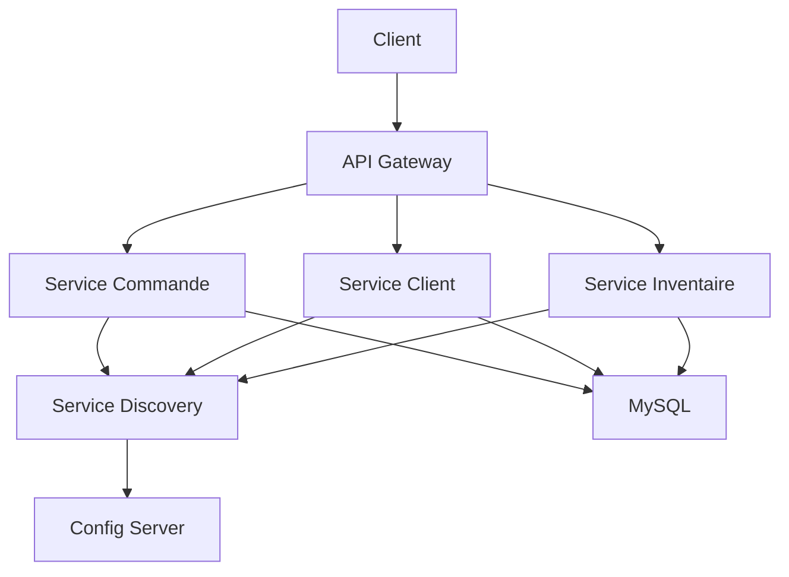

# Architecture Microservices avec Spring Boot et Docker

## 📋 Table des matières
- [Architecture](#-architecture)
- [Services](#-services)
- [Technologies](#-technologies)
- [Prérequis](#-prérequis)
- [Installation](#-installation)
- [Configuration](#-configuration)
- [Déploiement](#-déploiement)
- [API](#-api)
- [Base de données](#-base-de-données)
- [Tests](#-tests)
- [Contributions](#-contributions)

📦 Services
Service	Description	Port	Docker Image
config-service	Central configuration	8888	config-service:latest
discovery-service	Eureka Service Registry	8761	discovery-service:latest
gateway-service	API Gateway	8080	gateway-service:latest
order-service	Order processing	8081	order-service:latest
customer-service	Customer management	8082	customer-service:latest
inventory-service	Product inventory	8083	inventory-service:latest
mysql-db	MySQL Database	3306	mysql:8.0

